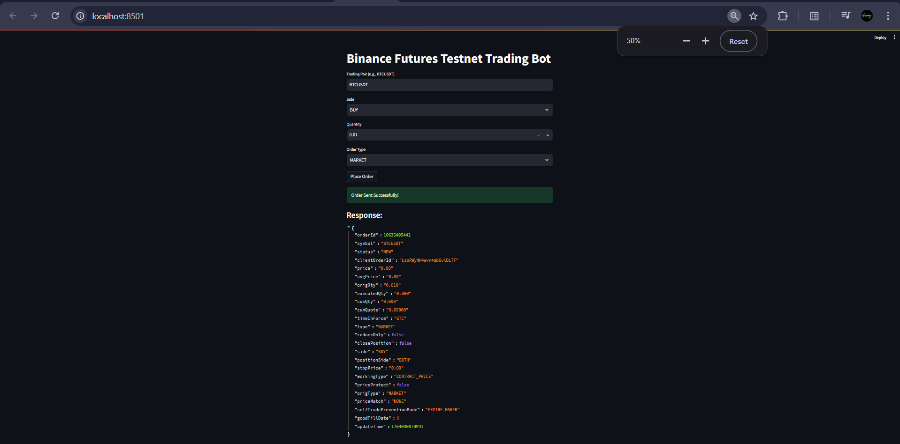
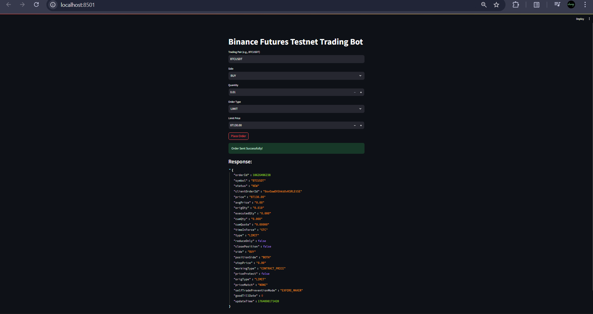
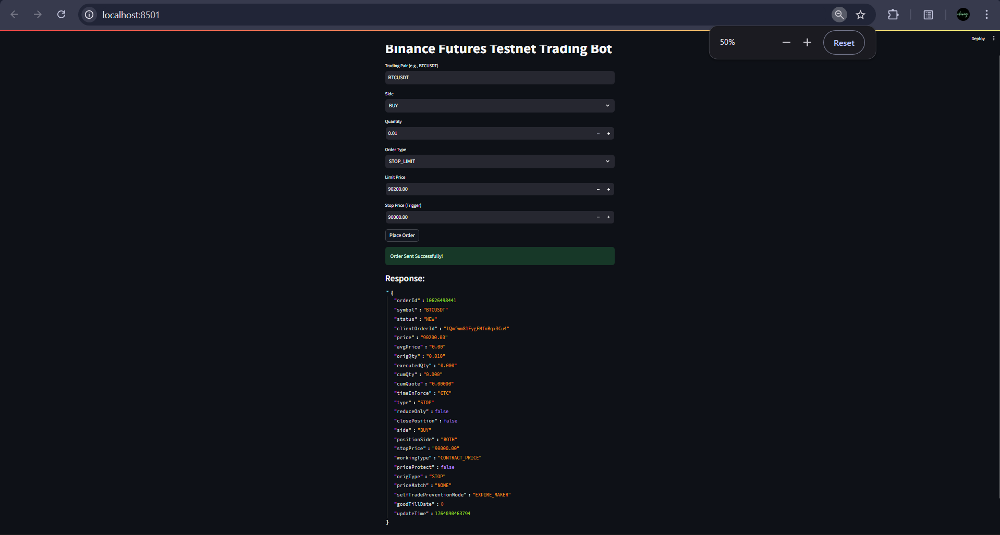

# Binance Futures Testnet Trading Bot

A modular Python-based trading bot for **Binance Futures Testnet**.  
It supports **Market**, **Limit**, and **Stop-Limit** orders with **input validation**, **logging**, and **real API execution** using the official Python Binance client.

---

## 🚀 Features

- Market & Limit orders  
- Stop-Limit order (bonus requirement)  
- Buy/Sell support  
- Structured CLI interface  
- Validations on symbol, price, quantity  
- Logging of requests, responses, and errors  
- Modular & reusable codebase  
- `.env` configuration support  

---

## 📂 Project Structure

```
binance-futures-bot/
│
├── bot/
│   ├── __init__.py
│   ├── basic_bot.py          # Trading logic (Market, Limit, Stop-Limit)
│   ├── client_factory.py     # Binance Client (Testnet setup)
│   ├── cli.py                # CLI input handling
│   ├── config.py             # Environment loader
│   └── logger.py             # Logging utilities
│
├── logs/
│   ├── bot.log               # Main log file
│   └── bot_copy.txt          # Backup log file
│
├── screenshots/
│   ├── screenshot1.png
│   ├── screenshot2.png
│   └── screenshot3.png
│
├── main.py                   # Entry point for running the bot
├── requirements.txt          # Required packages
├── .env.example              # Sample environment file
└── README.md
```

---

## ⚙️ Installation

```bash
git clone https://github.com/Chiragadve/binance-future-bot
cd binance-futures-bot

python -m venv venv
venv\Scripts\activate   # Windows  
# source venv/bin/activate   # macOS/Linux

pip install -r requirements.txt
```

---

## 🔐 Environment Setup

Create a `.env` file in root:

```
BINANCE_API_KEY=your_key_here
BINANCE_API_SECRET=your_secret_here
USE_TESTNET=True
```

Do **not** commit real API keys. An `.env.example` file is provided.

---

## ▶ Run the Bot

```bash
python main.py
```

Follow the CLI prompts to place market, limit, or stop-limit orders on the testnet.

---

## 📸 Screenshots

### 1. CLI Interface (Order Input)
Example of a Market order placed successfully.  


### 2. Successful Order Execution  
Example of a Limit order placed successfully.  


### 3. Error Handling & Logging  
Demonstrates Stop Limit order placed successfully. 


---

## 🧠 Logging Example

```
2025-11-25 21:10:22,385 | bot.basic_bot | INFO  | Stop-limit order request: {...}
2025-11-25 21:10:22,544 | bot.basic_bot | ERROR | Stop-limit order failed
APIError(code=-4184): Limit price can't be lower than 104500
```

Logs verify:
- Order request parameters  
- API responses  
- Error handling implemented correctly  

---
